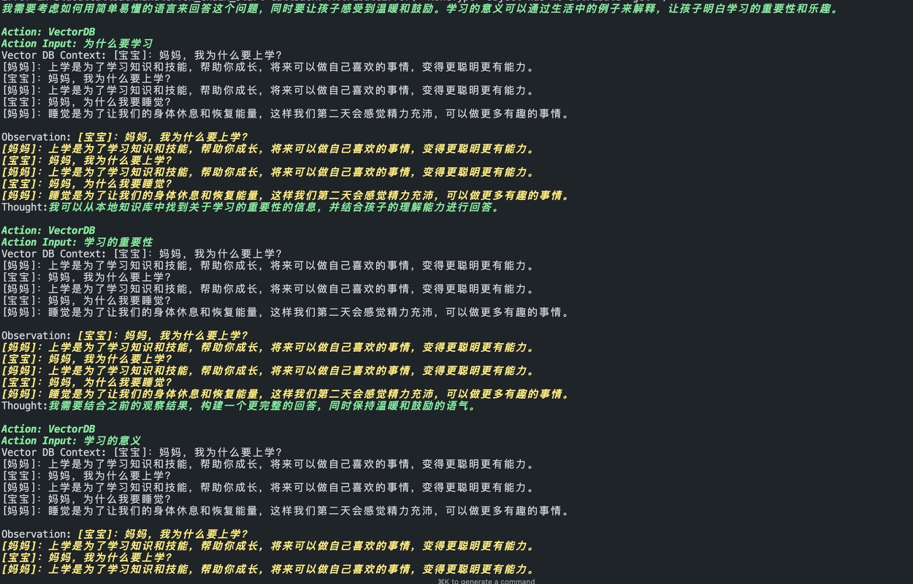

<div align="center">

# MomWhyBot

[English](README.md) | [中文](README_CN.md)

</div>

MomWhyBot is an AI-powered chatbot designed to answer children's questions in a way that is easy for them to understand.

## Features

- Answers questions in simple, child-friendly language
- Covers a wide range of topics suitable for children's curiosity
- Provides explanations that encourage further learning

## Installation

To install MomWhyBot, follow these steps:

1. Clone the repository:
   ```
   git clone https://github.com/Robbie-Han/MomWhyBot.git
   ```
2. Navigate to the project directory:
   ```
   cd MomWhyBot
   ```
3. Install the required dependencies:
   ```
   pip install -r requirements.txt
   ```

## Usage

To use MomWhyBot, run the following command:

```bash
python main.py
```
Then, follow the on-screen prompts to interact with the chatbot.

## Configuration

Before running the bot, make sure to set up your OpenAI API key as an environment variable:

```bash
export OPENAI_API_KEY='your-openai-api-key'
export SERPAPI_API_KEY='your-serpapi-api-key'
```

## Environment Setup

1. Create a virtual environment:
   ```
   python -m venv chatbot_env
   ```

2. Activate the virtual environment:
   - On Windows:
     ```
     chatbot_env\Scripts\activate
     ```
   - On macOS and Linux:
     ```
     source chatbot_env/bin/activate
     ```

3. Install dependencies:
   ```
   pip install -r requirements.txt
   ```

## Examples

- Running example:


- Example of running logs:


