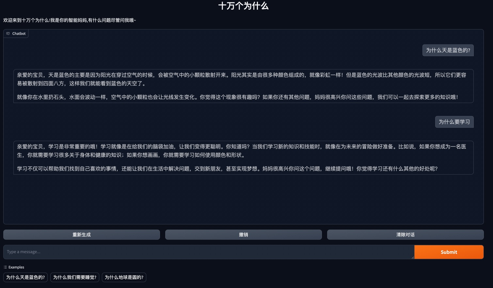
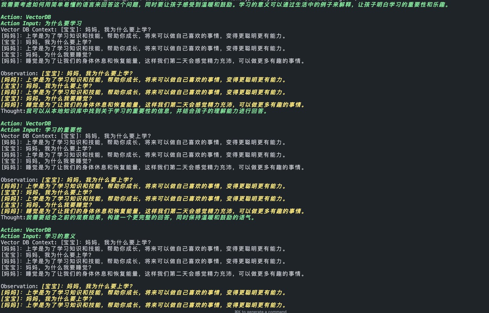

<div align="center">

# MomWhyBot

[English](README.md) | [中文](README_CN.md)

</div>

MomWhyBot 是一个 AI 驱动的"十万个为什么"聊天机器人，专为儿童设计。它利用 LangChain、GPT-4-mini、Google SerpAPI 和 Faiss 向量数据库等先进技术，扮演妈妈，为孩子们的无尽好奇心提供答案。

## 项目概述

MomWhyBot 旨在模仿孩子们常问的"为什么"问题,提供有趣、易懂且富有教育意义的回答。这个项目结合了多种技术,创造出一个智能、互动的学习体验。

## 主要特性

- 使用 GPT-4-mini 进行自然语言处理和生成
- 通过 Google SerpAPI 获取实时、准确的信息
- 利用 Faiss 向量数据库进行高效的相似性搜索
- 基于 LangChain 框架,实现灵活的 AI 应用开发

## 技术栈

- LangChain: AI 应用开发框架
- GPT-4-mini: 自然语言处理模型
- Google SerpAPI: 网络搜索 API
- Faiss: 高效的相似性搜索和聚类库
- Gradio: 用于创建 Web 界面的库

## 安装和使用

1. 确保您的系统中安装了 Python（建议使用 Python 3.7 或更高版本）。

2. 设置必要的环境变量:
```bash
export OPENAI_API_KEY='your-openai-api-key'
export SERPAPI_API_KEY='your-serpapi-api-key'
```
3. 运行 Python 脚本以启动 MomWhyBot。

## 环境设置

1. 创建虚拟环境:
   ```
   python -m venv chatbot_env
   ```

2. 激活虚拟环境:
   - 在 Windows 上:
     ```
     chatbot_env\Scripts\activate
     ```
   - 在 macOS 和 Linux 上:
     ```
     source chatbot_env/bin/activate
     ```

3. 安装依赖:
   ```
   pip install -r requirements.txt
   ```
## 示例
- 运行示例：


- 运行日志示例：
